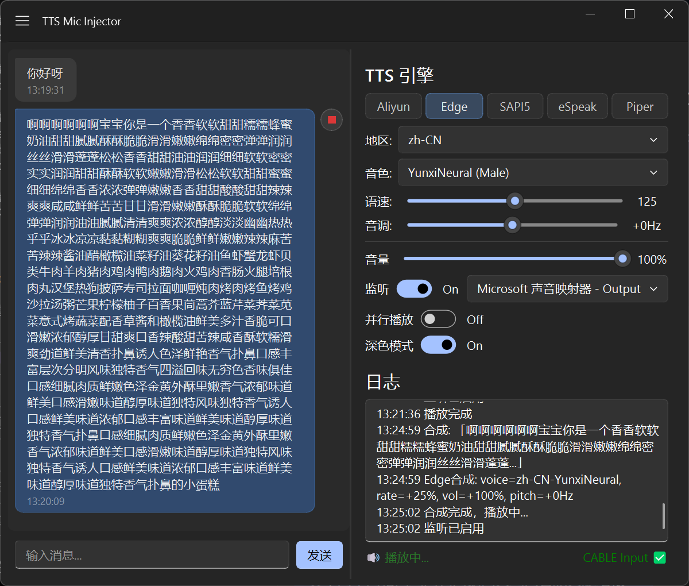

# TTS Mic Injector

将任意文字通过 TTS 合成后注入虚拟麦克风，在微信、QQ、钉钉等 VoIP 通话中使用。

> **适用场景**：语音通话中只能打字回应、游戏开黑不想开麦、语言障碍辅助等。



## 功能

| 功能 | 说明 |
|------|------|
| 💬 聊天式操作 | 左侧聊天气泡面板，消息可点击重放，播放中高亮 |
| 🎙️ 语音注入 | 合成后的音频输出到 VB-Cable 虚拟麦克风 |
| 🔊 实时监听 | 同时在扬声器播放，确认合成效果 |
| ⚡ 全局快捷键 | ESC 停止播放，Enter 发送，Ctrl+Enter 保存音频 |
| 📝 消息历史 | 所有消息保留在聊天列表，点击即可重放 |
| 🔀 并行播放 | 可选允许多条消息同时播放 |
| 🌗 深色模式 | 启动跟随系统主题，手动切换实时生效 |

## 支持的 TTS 引擎

| 引擎 | 类型 | 音色数 | 语速调节 | 需要额外安装 |
|------|------|--------|----------|-------------|
| **Aliyun** | 阿里云 Qwen TTS | 40+ | ❌ | dashscope + API Key |
| **Edge** | 微软云端 (免费) | 数百种 | ✅ | edge-tts, ffmpeg |
| **SAPI5** | Windows 本地 | 系统安装的语音 | ✅ | pywin32 |
| **eSpeak** | 本地开源 | 1 (中文) | ✅ | espeak-ng.exe |
| **Piper** | 本地神经网络 | 取决于 .onnx 模型 | ✅ | piper.exe + 模型 |

## 安装

### 方式一：预编译版本（推荐）

前往 [Releases]() 下载最新版可执行文件，解压即用。

### 方式二：从源码运行

#### 1. 安装 VB-Cable 虚拟声卡

首次启动应用时会**自动弹窗引导安装**，无需手动操作。

也可手动从 [vb-audio.com/Cable](https://vb-audio.com/Cable/) 下载安装，然后在系统声音设置中将「CABLE Input」设为默认通信设备。

#### 2. 安装 Python 依赖

```bash
pip install -r requirements.txt
```

或手动安装核心依赖：

```bash
pip install PyQt5 qfluentwidgets pyaudio pywin32 edge-tts

# 可选
pip install dashscope          # 阿里云引擎
pip install pyttsx3            # 备用系统 TTS
```

#### 3. 安装外部程序（按需）

| 引擎 | 下载地址 |
|------|---------|
| eSpeak NG | [github.com/espeak-ng/espeak-ng/releases](https://github.com/espeak-ng/espeak-ng/releases) |
| Piper | [github.com/rhasspy/piper/releases](https://github.com/rhasspy/piper/releases) |
| Piper 模型 | [huggingface.co/rhasspy/piper-voices](https://huggingface.co/rhasspy/piper-voices) |
| ffmpeg | [ffmpeg.org/download.html](https://ffmpeg.org/download.html) |

将 `espeak-ng.exe`、`piper.exe`、`ffmpeg.exe` 放入 PATH 或项目根目录，`.onnx` 模型放入 `piper_models/`。

## 配置

编辑项目根目录的 `config.json`：

```json
{
    "aliyun": {
        "api_key": "sk-你的密钥",
        "model": "qwen3-tts-flash-realtime",
        "voice": "Ethan"
    },
    "paths": {
        "espeak": "espeak-ng.exe",
        "piper": "piper.exe",
        "piper_models": "piper_models",
        "ffmpeg": "ffmpeg"
    }
}
```

完整配置项见 [config.json](config.json)。所有字段均有硬编码默认值，缺失时自动回退。

## 运行

```bash
python app.py
```

## 项目结构

```
├── app.py                  # 入口 (PyQt5 + Fluent Design)
├── config.json             # 用户配置
├── config.py               # 配置加载中心（默认值 + 合并）
├── requirements.txt        # Python 依赖清单
├── app/                    # UI 层 (PyQt5 + qfluentwidgets)
│   ├── main_window.py      # 主窗口，QSplitter 可拖拽双栏布局
│   ├── chat_widget.py      # 左侧聊天气泡面板
│   ├── message_item.py     # 聊天气泡组件
│   ├── settings_panel.py   # 右侧控制面板
│   ├── tts_interface.py    # TTS 交互抽象
│   ├── log_bridge.py       # 日志 → UI 桥接
│   └── utils/              # QConfig、日志、主题工具
├── service/
│   └── tts_service.py      # TTS 核心编排层
├── engines/                # 5 个 TTS 引擎
│   ├── base.py             # TTSEngine 抽象基类
│   ├── __init__.py         # 引擎工厂 create_engine()
│   ├── aliyun.py           # 阿里云 Qwen TTS
│   ├── edge.py             # Microsoft Edge TTS
│   ├── sapi5.py            # Windows SAPI5（异步初始化）
│   ├── espeak.py           # eSpeak NG
│   └── piper.py            # Piper 神经网络
├── audio/
│   └── player.py           # PyAudio 播放（VB-Cable + 监听双输出）
├── installer/
│   └── vbcable_installer.py # VB-Cable 一键安装器（下载/安装/检测）
├── ui/                     # 旧版 Tkinter UI（已废弃）
├── assets/
│   ├── icons/
│   └── qss/
└── tests/                  # 单元测试
```

## 打包为 exe

```bash
python build_qt.py
```

## 依赖

详见 [requirements.txt](requirements.txt)。

| 包 | 用途 |
|----|------|
| `PyQt5` | GUI 框架 |
| `qfluentwidgets` | Fluent Design 组件库 |
| `pyaudio` | 音频设备操作 |
| `pywin32` | Windows COM (SAPI5 引擎) |
| `edge-tts` | Microsoft Edge TTS |
| `dashscope` | 阿里云 TTS (可选) |

## License

MIT
